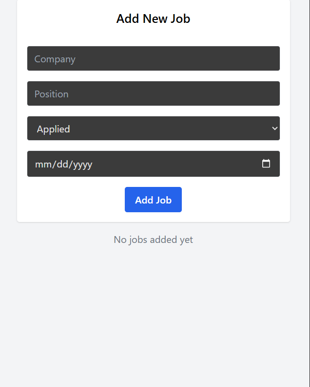

# 🎯 Job Application Tracker

A full-stack job application tracker built with **React**, **TypeScript**, **Express**, **Prisma**, and **SQLite**. It allows users to track job applications with fields like position, company, application stage, and date applied.

---

## 🚀 Features

- ✅ Add new job applications with relevant details
- ✅ View a list of all saved jobs
- ✅ Delete jobs with a custom confirmation popup
- ✅ Persistent storage using a real database (Prisma + SQLite)
- ✅ Clean and responsive UI with Tailwind CSS

---
---
## Screenshots

---
## 🛠️ Tech Stack

### Frontend
- [React]
- [TypeScript]
- [Tailwind CSS]

### Backend
- [Express.js]
- [Prisma ORM]
- [SQLite]

---

